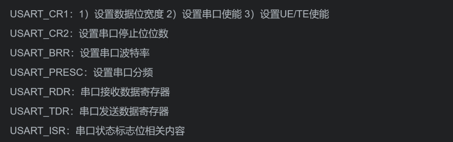
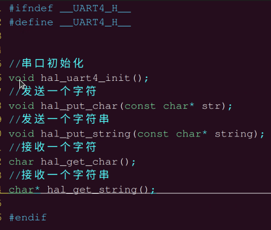
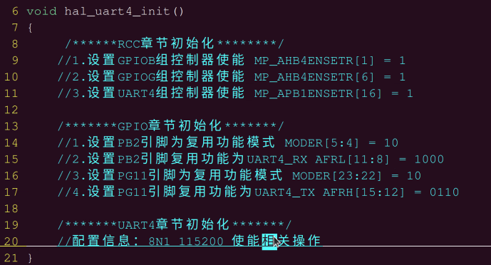
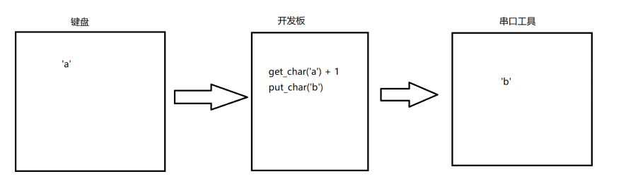

# 2023-06-11

- ## 任务
	- [[作业 实现字符串输入输出]]
- ## 补充
	- 
- ## 复习
	- ARM体系结构和接口技术
		- ARM相关概念
			- 特殊功能寄存器
				- SP
				- LR
				- PC
				- CPSR
				- SPSR
		- 汇编
			- 汇编指令
				- 通用指令格式
					- `<opcode> {cond}{s} Rd,Rn,#oprand2`
				- 数据操作指令
					- 数据搬移指令
						- 立即数
							- `mov`
							- `mvn` 按位取反
						- 非立即数
							- `ldr`
					- 移位操作指令
						- `lsl`
						- `lsr`
						- `asr` 算数右移
						- `ror`
					- 位运算操作指令
						- `and` 清零
						- `orr` 置1
						- `eor` 按位或
						- `bic`
					- 数据操作指令
						- `add`
						- `adc`
						- `sub`
						- `subc`
						- `mul`
					- 比较指令
						- `cmp`
				- 跳转指令
					- `b`
					- `bl`
				- 特殊功能寄存器
					- `mrs`
						- 写cpsr
					- `msr`
						- 读取cpsr
				- 内存操作指令
					- 单寄存器操作指令
						- `ldr ldrb ldrh`
					- 多寄存器
						- `ldm stm`
						- `ldmfd`
					- 栈指针
						- `ldmfd`
						- `stmfd`
			- 混合编程
				- 汇编调用函数
				- c调用汇编函数
				- c内敛汇编函数
	- 接口技术
		- LED 灯实验
			- cortex-a7核实现
			- cortex-m4核实现
		- UART实验 （串口实验）
			- PC <---> TARGET
				- ubuntu和单片机通信
		- 按键中断实验
			- 异常处理流程
			- 按键、光电、火焰传感器、人体红外传感器
		- IIC实验
			- 采集温度湿度传感器
		- SPI实验
			- 数码管显示相应的值
		- PWM实验
			- 风扇
			- 蜂鸣器
			- 马达
- ## 后期
	- 系统移植 7 天
	- linux驱动开发 11 天
	- 面试题
		- 串口 
- ## arm-day07
	- [[FIQ为什么比IRQ快]]
	- Universal synchronous/asynchronous receiver transmitter (USART/UART)
	- **发送字符流程 （2612）**
		1. 编程将USART_CR1中的M位设置为定义字长。  
		2. 使用USART_BRR寄存器选择所需的波特率。  
		3. 在USART_CR2中编程停止位的数量。  
		4. 通过将USART_CR1寄存器中的UE位写为1来启用USART。  
		5. 如果需要进行多缓冲区通信，则在USART_CR3中选择DMA使能（DMAT）。根据第53.5.10节的说明配置DMA寄存器：USART多处理器通信。  
		6. 设置TE位于USART_CR1中以发送空闲帧作为第一次传输。  
		7. 将要发送的数据写入USART_TDR寄存器。在单个缓冲区的情况下，为每个要传输的数据重复此操作。
			- 当FIFO模式被禁用时，将数据写入USART_TDR会清除TXE标志。
			- 当FIFO模式被启用时，将数据写入USART_TDR会将一个数据添加到TXFIFO中。在TXFNF标志设置时执行对USART_TDR的写操作。此标志保持设置，直到TXFIFO已满。  
		8. 当最后一个数据被写入USART_TDR寄存器时，等待TC=1。
			- 当FIFO模式被禁用时，这表示最后一帧的传输已完成。
			- 当FIFO模式被启用时，这表示TXFIFO和移位寄存器都为空。  
			    这个检查是必需的，以避免在禁用USART或进入时破Halt模式坏最后一次传输。
		- 总结
			- 
	- **接收字符流程**   （53.5.6  USART receiver 2614）
		- 设置串口
	- [[为什么要用 FIFO mode disabled]]
	- [[寄存器保留位的作用]]
	- [[UART既然16位的采样率各方面都优于8位，为什么还需要有8位的]]
	- 如何设置BRR寄存器
		- BRR = 时钟频率 / 波特率
		- ISR寄存器
	- `.h`
		- 
	- `.c`
		- 初始化
			- 
		- 发送
	- 现象
		- 字符发送
			- 
		- 字符串