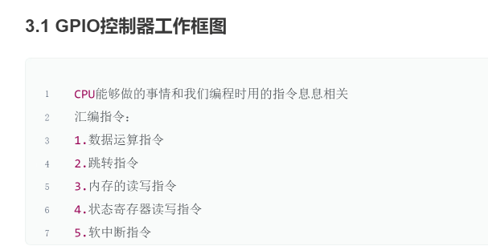

# GPIO控制器的工作原理

#不理解
1. 配置GPIO端口：在嵌入式系统中，GPIO端口通常由特定的硬件引脚实现。在使用GPIO端口之前，需要将其配置为输入或输出模式。这通常通过设置控制寄存器中的位来实现。
    
2. 读取输入信号：在输入模式下，GPIO端口将读取外部数字信号的状态，并将其传递给嵌入式系统处理器。处理器可以通过读取GPIO寄存器来获取输入信号的状态。如果输入信号的状态发生变化，GPIO控制器将触发中断请求，以便处理器能够及时响应。
    
3. 发送输出信号：在输出模式下，GPIO端口将发送数字信号到外部设备。处理器可以通过写入GPIO寄存器来控制输出信号的状态。如果输出信号的状态发生变化，GPIO控制器将立即将新状态发送到外部设备。
    

