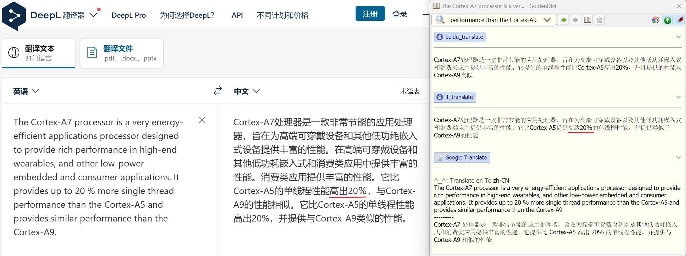
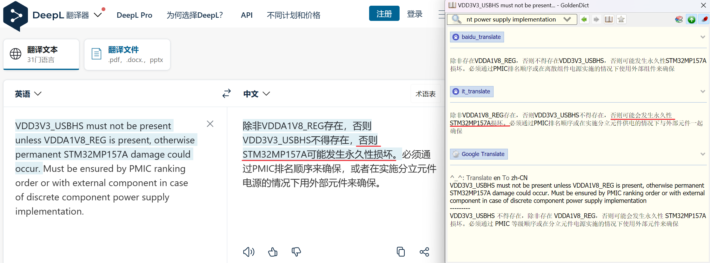

# GoldenDict调用百度领域翻译api

>[百度领域翻译API文档](http://api.fanyi.baidu.com/product/113)

## 前言

收到一封百度的推广邮件，升级针对行业领域翻译的API，浅浅尝试一下


## 思路

> 通过 Goldendict 调用 python脚本 发送 get 请求，并显示

完整的 `get` 请求是这样的，只需要将要查询的内容拼接进去，然后调用就好了
```url
http://api.fanyi.baidu.com/api/trans/vip/translate?q=apple&from=en&to=zh&appid=2015063000000001&salt=1435660288&sign=f89f9594663708c1605f3d736d01d2d4
```
- [appid 和 key](http://api.fanyi.baidu.com/manage/developer)需要通过注册开发者，填写身份信息后才能获取

## 代码实现

```python
import http.client
import hashlib
import json
import urllib
import random
import sys
import re

#main
def baidu_translate_goldendict(content):
    """
    主方法main
    """
    target_language(content)
    pass

#判断是否有中文，确定目标语言
def target_language(content):
    targetLanguage = "zh"
    zhPattern = re.compile(u'^[\u4e00-\u9fa5]')
    match = zhPattern.search(content)
    if match:
        targetLanguage = "en"
        
    content_baidu_translate(content,targetLanguage)
    pass

#百度翻译API请求(coding: utf8)
def content_baidu_translate(content,targetLanguage):
    """
    Official method from Baidu
    """
    appid = 'appid'  # 填入 appid 
    secretKey = 'key'  # 填入 key
    httpClient = None
    myurl = '/api/trans/vip/fieldtranslate'
    q = content
    fromLang = 'auto' # 原始语言
    toLang = targetLanguage   # 原始语言
    salt = random.randint(32768, 65536)
    domain = 'it'

    # Step1 拼接字符串
    sign = appid + q + str(salt) + domain + secretKey

    # Step2 对字符串1做md5，得到32位小写sign
    sign = hashlib.md5(sign.encode()).hexdigest()
    myurl = myurl + '?appid=' + appid + '&q=' + urllib.parse.quote(
        q) + '&from=' + fromLang + '&to=' + toLang + '&salt=' + str(
        salt) + '&domain=' + domain + '&sign=' + sign
 
    try:
        httpClient = http.client.HTTPConnection('api.fanyi.baidu.com')
        httpClient.request('GET', myurl)
        
        response = httpClient.getresponse() # response是HTTPResponse对象
        jsonResponse = response.read().decode("utf-8")# 获取JSON响应
        js = json.loads(jsonResponse)  # JSON转换
        content_print_byformat(js) # 输出结果
    except Exception as e:
        print(e)
    finally:
        if httpClient:
            httpClient.close()

#格式化输出
def content_print_byformat(js):
    """
    set print format
    reference http://api.fanyi.baidu.com/product/113
    """
    dstStr = str(js["trans_result"][0]["dst"])  # result
    
    # 替换\n
    if("\\r\\n" in dstStr):
        dstStr = dstStr.replace("\\r\\n","\n")
    if('[\u4e00-\u9fa5]+[\da-zA-Z]+' in dstStr):
        dstStr = dstStr.replace("$1 $2")
    print(dstStr)
    pass

if __name__ == '__main__':
    #入口
    baidu_translate_goldendict(sys.argv[1])
```

## 测试


<center style="font-size: 12px;">测试图1</center>



<center style="font-size: 12px;">测试图2</center>

翻译效果差强人意，能看出确实是有一些优化的，比如在语序上，但优化的不多