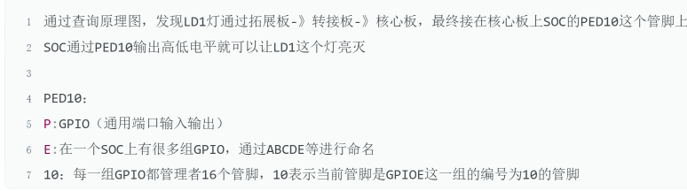
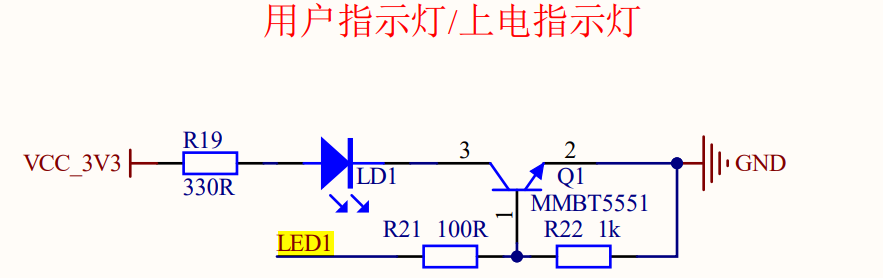
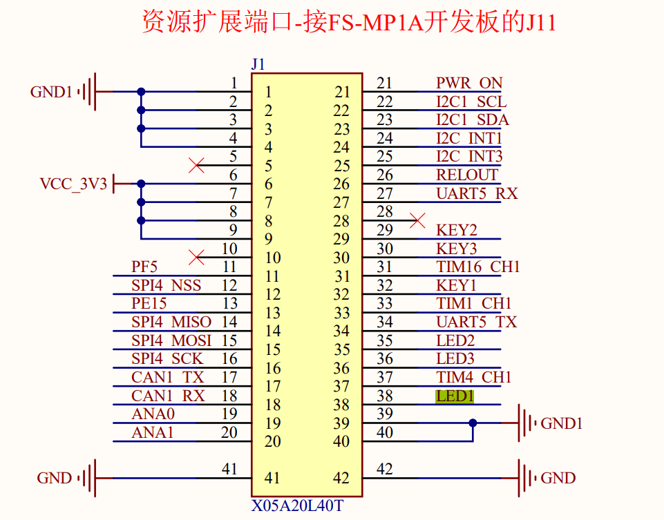
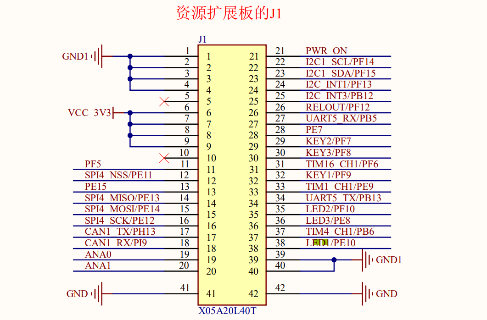
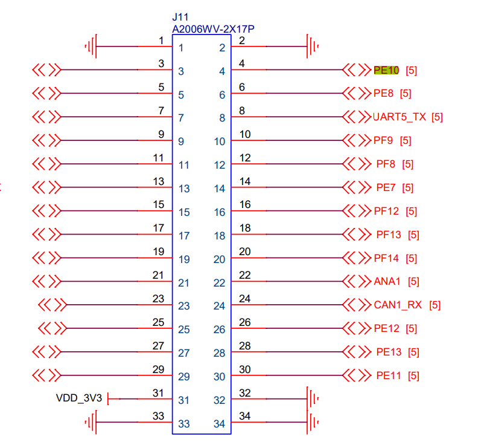
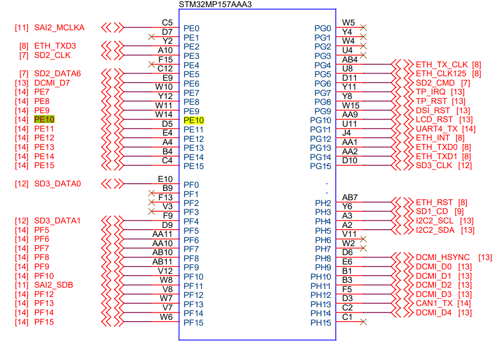

# LED1原理图

扩展板
`D:\user\documents\学习资料\arm\STM32MP157\01_参考资料\01.2_原理图\扩展板\FS_MP1A_Extend_v1.2.pdf`

转接包
`D:\user\documents\学习资料\arm\STM32MP157\01_参考资料\01.2_原理图\扩展板\FS_MP157_PHD_TO_FFC.pdf`

核心板
`D:\user\documents\学习资料\arm\STM32MP157\01_参考资料\01.2_原理图\主板\FS_MP1A.pdf`

