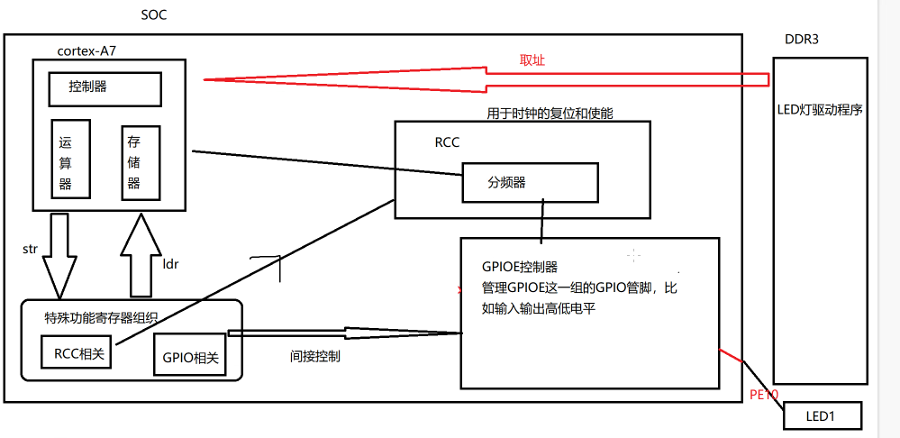

# LED灯控制实现

- rcc [时钟](时钟.md)

- [芯片手册分析](芯片手册分析.md)
	- [通过特殊功能寄存器配置GPIO](通过特殊功能寄存器配置GPIO.md)
	- rcc相关寄存器配置
		- [时钟和晶振有什么区别](时钟和晶振有什么区别.md)
		- [为什么要时钟使能](为什么要时钟使能.md)？ #待收录 
		- 微处理器和微控制器的区别？ #待收录 
			- MCU
			- MP
- 软件编写
	- [交叉编译Makefile文件配置](交叉编译Makefile文件配置.md)
	- [编写汇编程序控制 GPIO 控制器 和 RCC 进行工作](编写汇编程序控制%20GPIO%20控制器%20和%20RCC%20进行工作.md)
- [下载到开发板](下载到开发板.md)

