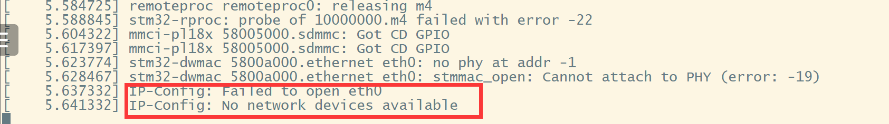
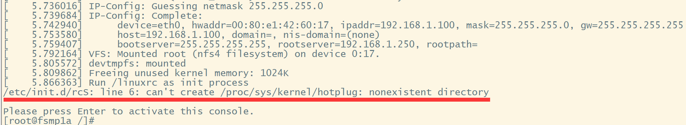
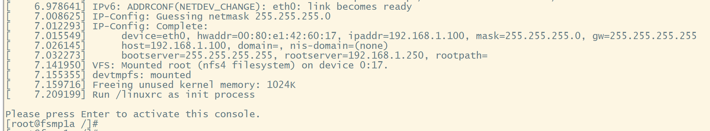
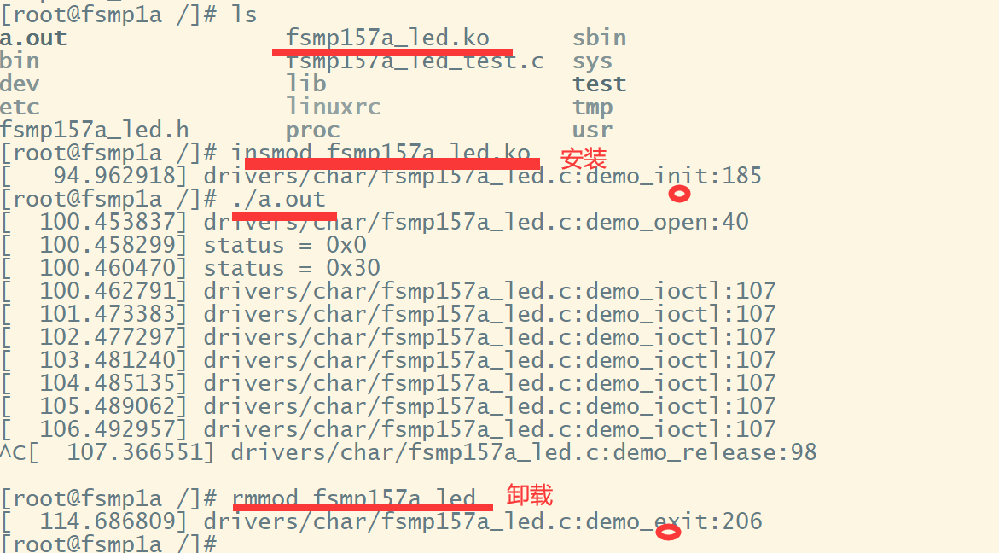
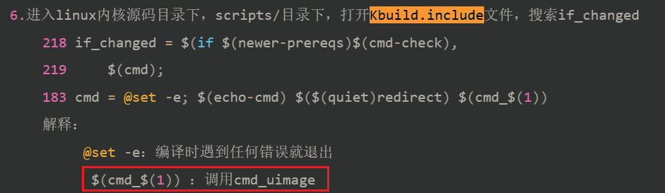
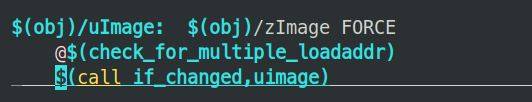

# Linux内核移植

## 分析内核源码

> 下载源码 [en.SOURCES-stm32mp1-openstlinux-5.10-dunfell-mp1-21-11-17_tar_v3.1.0.xz](https://st.com/content/ccc/resource/technical/sw-updater/firmware2/group0/2b/04/61/eb/4c/83/4d/3d/stm32cube_standard_a7_bsp_components_tf_a/files/SOURCES-tf-a-stm32mp1-openstlinux-5-10-dunfell-mp1-21-11-17_tar.xz/_jcr_content/translations/en.SOURCES-tf-a-stm32mp1-openstlinux-5-10-dunfell-mp1-21-11-17_tar.xz)

### 阅读 README

> `stm32mp1-openstlinux-5.10-dunfell-mp1-21-11-17/sources/arm-ostl-linux-gnueabi/linux-stm32mp-5.10.61-stm32mp-r2-r0\README.HOW_TO.txt`

```txt
Compilation of kernel:
1. Pre-requisite
2. Initialise cross-compilation via SDK
3. Prepare kernel source code
4. Manage the kernel source code
5. Configure kernel source code
6. Compile kernel source code
7. Update software on board
```

1. 需要安装库信息：
```shell
Ubuntu: sudo apt-get install u-boot-tools
```
2. 解压内核源码
```shell
$> tar xfJ linux-5.10.61.tar.xz
```
3. 进入内核源码目录    
```shell
$> cd linux-5.10.61
```
4. 对内核源码进行打补丁
 ```shell
$> for p in `ls -1 ../*.patch`; do patch -p1 < $p; done
```
5. 配置补丁文件列表的相关信息
```shell
$ make ARCH=arm multi_v7_defconfig fragment*.config
```
6. 编译内核源码
```shell
$ make ARCH=arm uImage vmlinux dtbs LOADADDR=0xC2000040  
```
7. 采用模块化方式进行编译
```shell
$ make ARCH=arm modules
```
8. 产生文件路径：
	- uImage镜像文件：内核源码/arch/arm/boot/uImage
	- 设备树镜像文件：内核源码/arch/arm/boot/dts/st*.dtb

### 内核目录

1. 对内核源码进行解压
```shell
cd ~/FSMP1A/linux-stm32mp-5.10.61-stm32mp-r2-r0
tar -vxf linux-5.10.61.tar.xz
```
2. 进入linux内核源码目录下
```shell
cd linux-5.10.61/ 
```
3. 目录介绍
```shell
arch  -------->存放各个架构的内容(arm/X86架构) 
block -------->块设备相关内容 
certs  -------->列表信息 
COPYING -------->内核描述文档 
CREDITS -------->内核贡献者列表 
Documentation-------->内核帮助文档（所以内核的信息都可以在这个帮助文档中找到） 
drivers -------->驱动相关代码 
fs   -------->文件系统相关代码 
include -------->内核中头文件目录 
init -------->内核初始化相关代码 
ipc-------->内核中进程间通信相关代码 
Kbuild -------->Makefile会调用这个文件完成内核编译 
Kconfig --------> 生成基于图形化菜单界面信息(make menuconfig) 
lib  --------> 内核库相关信息 
LICENSES -------->遵循GPL协议 
MAINTAINERS -------->内核当前贡献者列表 
Makefile -------->工程管理文件 
scripts -------->和编译相关目录（shell脚本） 
security-------->内核安全相关代码 
tools-------->内核源码工具目录 
crypto -------->内核加密算法 
```

## 移植内核

### 编译内核

```shell
1.进入linux内核源码目录，配置交叉编译工具链，打开Makefile文件，搜索：CROSS_COMPILE
     370 ARCH        ?= $(SUBARCH) 
     371      
     更改为：
    370 ARCH        ?= arm
    371 CROSS_COMPILE := arm-linux-gnueabihf-                      
2.对内核源码进行打补丁
     for p in `ls -1 ../*.patch`; do patch -p1 < $p; done
3.配置补丁文件列表的相关信息
     make ARCH=arm multi_v7_defconfig fragment*.config
    成功现象：
    # 
    # configuration written to .config 
    # 
4.因为FSMP1A开发板是参考DK1平台进行设计，所以将DK1公板设备树相关内容，复制为FSMP1A设备树
    1）进入linux-5.10.61/arch/arm/boot/dts设备树目录，复制相关内容
        cp stm32mp157a-dk1.dts  stm32mp157a-fsmp1a.dts 
        cp stm32mp15xx-dkx.dtsi  stm32mp15xx-fsmp1x.dtsi
    2）进入linux-5.10.61/arch/arm/boot/dts设备树目录，打开 vi stm32mp157a-fsmp1a.dts
        13 #include "stm32mp15xx-fsmp1x.dtsi"  --------> 这一行为修改内容 
        14 
        15 / { 
        16     model = "HQYJ STM32MP157A-FSMP1A Discovery Board";    --------> 这一行为修改内容                                                     
        17     compatible = "hqyj,stm32mp157a-fsmp1a", "hqyj,stm32mp157";  --------> 这一行为修改内容
     3）进入linux-5.10.61/arch/arm/boot/dts设备树目录，打开 vi Makefile
        1097     stm32mp157a-dk1.dtb \
        1098     stm32mp157a-fsmp1a.dtb \    --------> 这一行为修改内容   
5.在内核源码目录下，编译内核源码
    time make -j4 ARCH=arm uImage vmlinux dtbs LOADADDR=0xC2000000 
    解释：
     time：显示编译时间
     ARCH=arm：指定arm架构
      uImage：编译生成uImage镜像文件
       vmlinux：elf可执行文件
        dtbs：编译设备树
         LOADADDR=0xC2000000 ：指定加载地址
6.成功现象：
  OBJCOPY arch/arm/boot/zImage
  Kernel: arch/arm/boot/zImage is ready
  UIMAGE  arch/arm/boot/uImage
Image Name:   Linux-5.10.61 
Created:      Wed Jun 21 17:04:58 2023 
Image Type:   ARM Linux Kernel Image (uncompressed) 
Data Size:    7172008 Bytes = 7003.91 KiB = 6.84 MiB
Load Address: c2000000
Entry Point:  c2000000
  Kernel: arch/arm/boot/uImage is readyreal	5m46.234s
user	19m0.143s
sys	2m3.807s

```

#### 测试

报错显示网络设备不存在


### 移植网卡驱动

设置 Ubuntu 的 IP 地址，新添加一个网络，手动分配地址

```shell
192.168.1.200  #本机IP地址
255.255.255.0  #子网掩码
192.168.1.1    #网关地址
8.8.8.8        #DNS
```

开发板设置静态IP

```shell
setenv ipaddr 192.168.1.100   #设置开发板的 IP 地址
setenv serverip 192.168.1.200 #指定服务器 IP 地址
setenv gatewayip 192.168.1.1  #指定网络网关的 IP 地址
setenv netmask 255.255.255.0  #指定子网掩码
saveenv                       #保存设置
```

测试开发板网络

> 在开发板上 ping 服务器的 IP 地址

```shell
ping 192.168.1.200
```

显示结果如下，即为组内网成功
```shell
Using ethernet@5800a000 device
host 192.168.1.200 is alive
```

#### 测试

报错显示由热插拔问题


### 解决热插拔问题

```shell
Device Drivers  --->
    Generic Driver Options  ---> 
            [*] Support for uevent helper                                                           
                (/sbin/hotplug) path to uevent helper 

```

#### 测试

成功进入linux内核


## LED例程  📣

>**1. 内核裁剪指的是什么**  需要模块进行编译，不需要的模块不进行编译
>**2. 如何对内核进行裁剪** 通过make menuconfig命令

### 图形化界面信息配置


### 驱动模块化编译

```shell
0.在内核源码目录下，编译内核源码
    time make -j4 ARCH=arm uImage vmlinux dtbs LOADADDR=0xC2000000 
1.采用模块化方式进行编译
    make -j4 modules
    成功现象： LD [M]  drivers/char/fsmp157a_led.ko
2.将linux内核源码编译生成的uImage镜像文件和设备树镜像文件拷贝到~/tftpboot目录下
    cd ~/FSMP1A/linux-stm32mp-5.10.61-stm32mp-r2-r0/linux-5.10.61
    cp arch/arm/boot/uImage ~/tftpboot/ 
    cp arch/arm/boot/dts/stm32mp157a-fsmp1a.dtb ~/tftpboot/
    cp drivers/char/fsmp157a_led.ko ~/nfs/rootfs --------->以及采用模块化方式编译的文件，拷贝到~/nfs/rootfs 3.设置bootcmd参数：自启动命令
    FSMP1A>  setenv bootcmd tftp 0xc2000000 uImage\;tftp 0xc4000000 stm32mp157a-fsmp1a.dtb\;bootm 0xc2000000 - 0xc4000000 
    FSMP1A>  saveenv
    Saving Environment to MMC... Writing to redundant MMC(1)... OK
 4.设置bootargs参数：自启动参数
FSMP1A>  setenv bootargs root=/dev/nfs nfsroot=192.168.1.250:/home/linux/nfs/rootfs,tcp,v4 rw console=ttySTM0,115200 init=/linuxrc ip=192.168.1.100 
FSMP1A>  saveenv
Saving Environment to MMC... Writing to MMC(1)... OK
    解释：
    root=/dev/nfs：使用nfs服务器
    nfsroot=192.168.1.250:/home/linux/nfs/rootfs：挂载的ip地址以及路径，每个人ip地址，以及路径需要编写自己设置！！！
     ip=192.168.1.100：板子的ip地址，每个人ip地址，需要编写自己设置！！！
 5.重启开发板，进入自启动模式，安装led灯驱动
     [root@fsmp1a /]# insmod fsmp157a_led.ko 
    成功现象：[94.962918] drivers/char/fsmp157a_led.c:demo_init:185 
6.运行应用层程序
    [root@fsmp1a /]# ./a.out 
    成功现象：
    [  100.453837] drivers/char/fsmp157a_led.c:demo_open:40 
    [  100.458299] status = 0x0 
    [  100.460470] status = 0x30 
    [  100.462791] drivers/char/fsmp157a_led.c:demo_ioctl:107 
7.卸载对应的驱动    [root@fsmp1a /]# rmmod fsmp157a_led
    [  114.686809] drivers/char/fsmp157a_led.c:demo_exit:206
```

#### 测试



## 编译过程 📣

>1. vmlinux
>2. objcopy
>3. Image
>4. gzip
>5. arch/arm/boot/compressed/vmlinux
>6. objcopy
>7. zImage
>8. mkimage
>9. uImage

#待学习

执行命令
```shell
make uImage LOADADDR=0xC2000000
```

arch/arm目录下，打开Makefile文件，搜索：uImage
```shell
315 BOOT_TARGETS    = zImage Image xipImage bootpImage uImage
323 $(BOOT_TARGETS): vmlinux
324     @echo $(Q) 
325     @echo $(MAKE) 
326     @echo $(build) 
327     @echo $(boot) 
328     @echo $(MACHINE) 
329     @echo $(boot)                                                                                             
330     @echo $@
331     $(MAKE) $(build)=$(boot) MACHINE=$(MACHINE) $(boot)/$@
332     @$(kecho) '  Kernel: $(boot)/$@ is ready' 
```

### Kbuild.include

打开 Kbuild.include文件，查看编译过程



### Makefile.lib

检查加载地址
```shell
@$(check_for_multiple_loadaddr)
```

call是调用命令，调用if_changed命令
- Makefile.lib中包含了一些共用的编译规则和函数，用于简化内核代码的编译过程，其中就含有 cmd_uimage
```shell
$(call if_changed,uimage) ——————————————>执行cmd_uimage
```


**uImage是通过zImage得到，将zImage通过 mkimage这个工具添加64字节头部信息**

### arch/arm/boot/Makefile

打开 arch/arm/boot/Makefile 文件，找到目标


**arch/arm/boot/compressed/vmlinux通过objcopy命令格式化转换为zImage**

