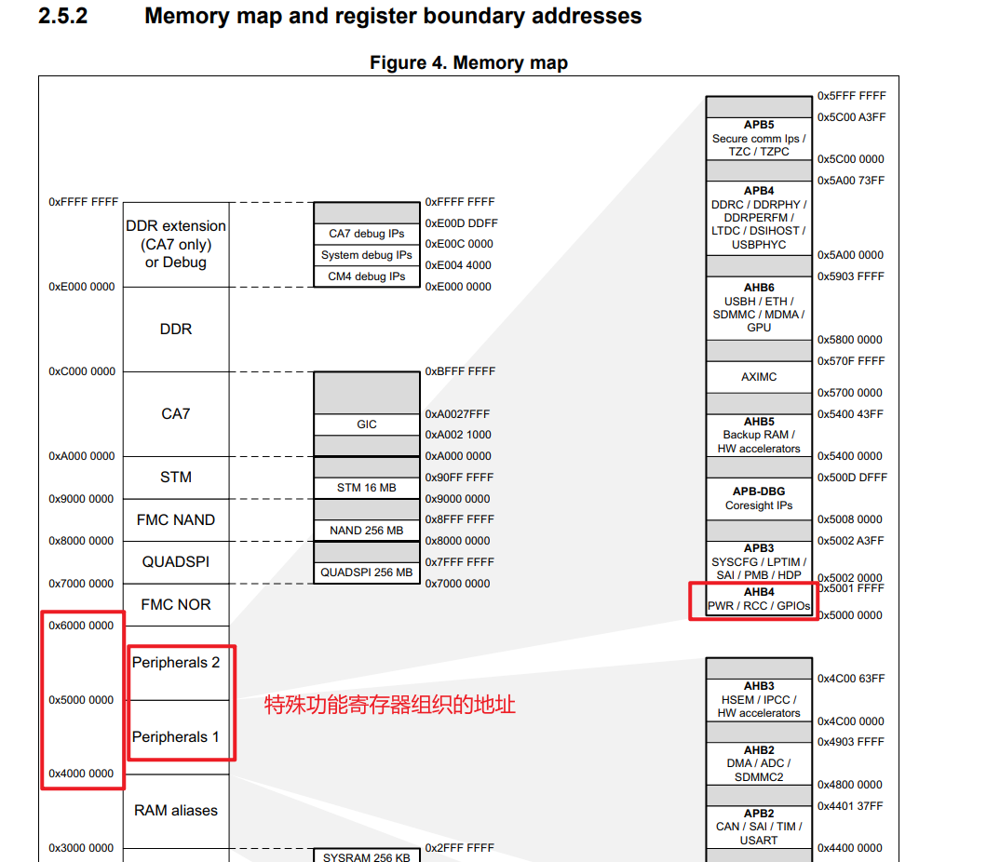
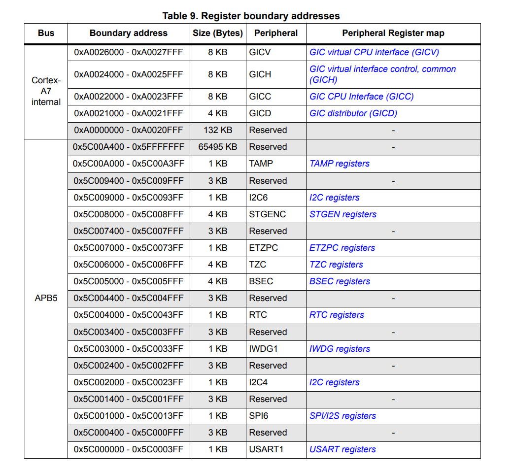

# STM32MP157特殊功能寄存器

## 定义

在 [STM32MP157](STM32MP157.md) 中，会将（芯片厂商设计）
- [Cortex-A7](Cortex-A7.md) 核心的 [特殊功能寄存器](ARMv7特殊功能寄存器.md) （ARM公司设计）
- 以及一些Cortex-A7 处理器没有的特殊功能寄存器
	- 时钟控制寄存器（Clock Control Register, CCR）
	- 复位控制寄存器（Reset Control Register, RCR）
**重新组织**，即**被重命名且映射到不同的地址**。

- 组织在**Peripherals 1**中的特殊功能寄存器
	- 包括了一些与外设相关的特殊功能寄存器，例如 GPIO、UART、I2C、SPI 等外设的控制寄存器
- 组织在**Peripherals 2**中的特殊功能寄存器
	- 包括了 Cortex-A7 处理器的特殊功能寄存器以及一些与系统时钟、复位等相关的特殊功能寄存器

这些寄存器被映射到不同的地址，并且具有不同的名称和用途。

## 注意

- 由于映射的存在，在编写 STM32MP157 的软件时，需要参考 STM32MP157 的文档来了解它们的具体用法和地址映射，而不能直接参考 Cortex-A7 的文档。