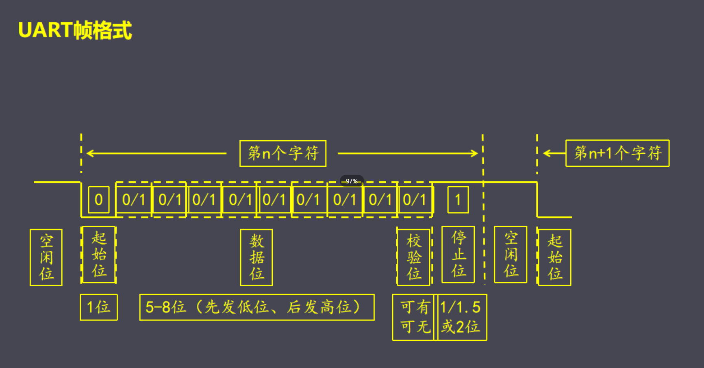

# UART工作原理

## 定义

[UART](UART.md) 的帧格式包括
- 空闲位 默认高电平
- 起始位 默认低电平
- 数据位 从低位到高位发送数据（5~8位）
- 校验位 自定义，一般采用采用奇/偶校验 （1的个数）
- 停止位 

## 示例

以 `0x55 `为例，即数据为`01010101`

| 空闲位 | 起始位 | 数据位   | 校验位 | 停止位 |
| ------ | ------ | -------- | ------ | ------ |
| 1      | 0      | 10101010 | 1      | 1      | 

如何知道 UART 发送了几位 #待收录 
- 通过 [[波特率]] 得知

