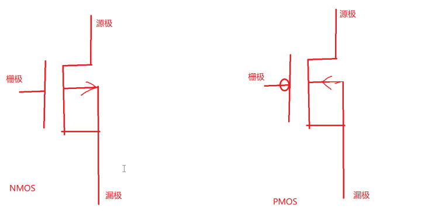

# mos管

MOS管（Metal-Oxide-Semiconductor Field-Effect Transistor）是一种基于场效应原理的半导体器件，也被称为 MOSFET。MOS管的结构类似于晶体管，由源极、漏极和栅极三个电极组成。其中，源极和漏极之间的导电通道由半导体材料形成，栅极则是通过氧化物绝缘层隔离在半导体材料上方。

MOS管的特点是具有高输入阻抗、低输出阻抗、高速开关和低功耗等优点。它可以通过调节栅极电压来控制源极和漏极之间的电流，因此被广泛应用于电路中的开关、放大器、稳压器等电路中。

根据 MOS管的工作原理和结构特点，可以将其分为 N 沟道 MOS 管和 P 沟道 MOS 管两种类型。其中，N 沟道 MOS 管的导电通道由 N 型半导体材料形成，需要在栅极上施加正电压才能形成导电通道；而 P 沟道 MOS 管的导电通道由 P 型半导体材料形成，需要在栅极上施加负电压才能形成导电通道。

需要注意的是，MOS管在使用时需要注意电压和电流的限制，以免损坏器件。此外，MOS管的驱动电路也需要根据具体的应用场景来设计，以保证其正常工作。

[mos管和三极管的区别](mos管和三极管的区别.md)
