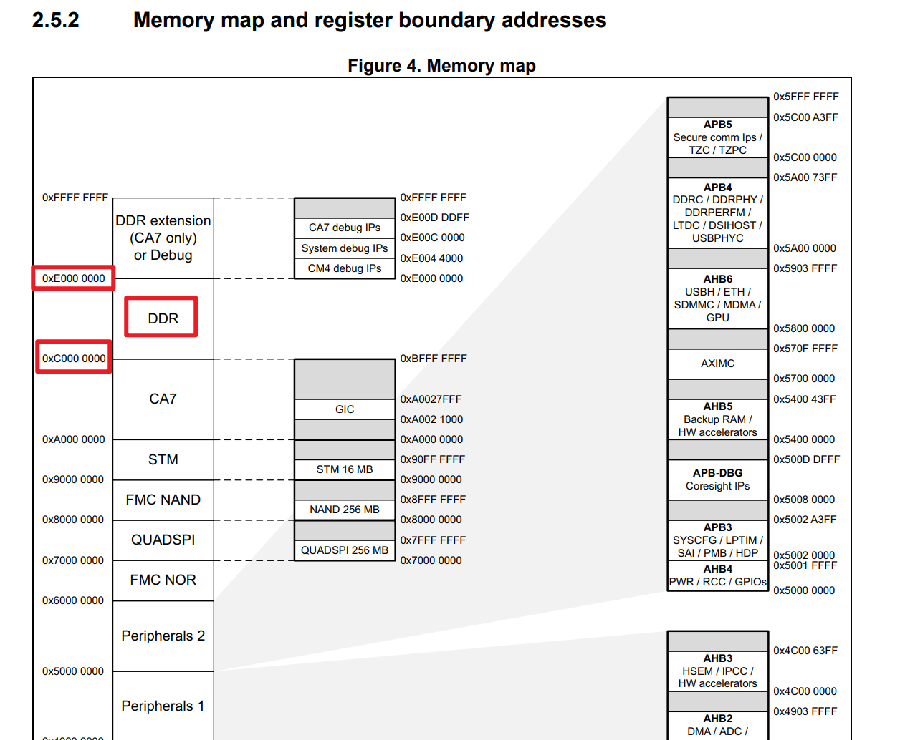

# 交叉编译Makefile文件配置

```bash
#指定编译的文件名
NAME=asm-led

#指定当前是使用的交叉编译工具链前缀
CROSS_COMPILE = arm-linux-gnueabihf- 

#指定使用的编译器为交叉编译工具链的gcc
CC = $(CROSS_COMPILE)gcc

#指定当前使用的链接器为交叉编译工具链的链接
LD = $(CROSS_COMPILE)ld

#编译时加了这个参数作用是将二进制文件编译生成二进制的bin文件
OBJCOPY = $(CROSS_COMPILE)objcopy

#编译时加了这个参数作用是进行反汇编编译，生成一个.dis后缀的反汇编文件
OBJDUMP = $(CROSS_COMPILE)objdump
 
all: 
 #编译生成二进制的文件，没有链接   -O0设置优先级最低 -g表示允许二进制文件支持GDB调试 
	$(CC) -O0 -g -c $(NAME).S -o $(NAME).o
	
#链接.o文件生成一个二进制的elf文件	-Ttext=0xC0008000表示将程序加载到内存的0XC0008000位置
	$(LD) -Ttext=0xC0008000 $(NAME).o -o $(NAME).elf 
	
#将elf的可执行文件编译成.bin的二进制文件，这个后缀的文件可以之家下载到开发板，被处理器解析	
	$(OBJCOPY) -O binary $(NAME).elf  $(NAME).bin
	
#生成反汇编文件
	$(OBJDUMP) -D $(NAME).elf > $(NAME).dis
	
clean: 
	rm -rf *.elf *.bin *.o *.dis
 
install: 
 #将bin二进制文件复制到共享文件夹
	sudo cp $(NAME).bin  /mnt/hgfs/share1/ 
```


为什么要LD到 0xC0008000 #待收录 

