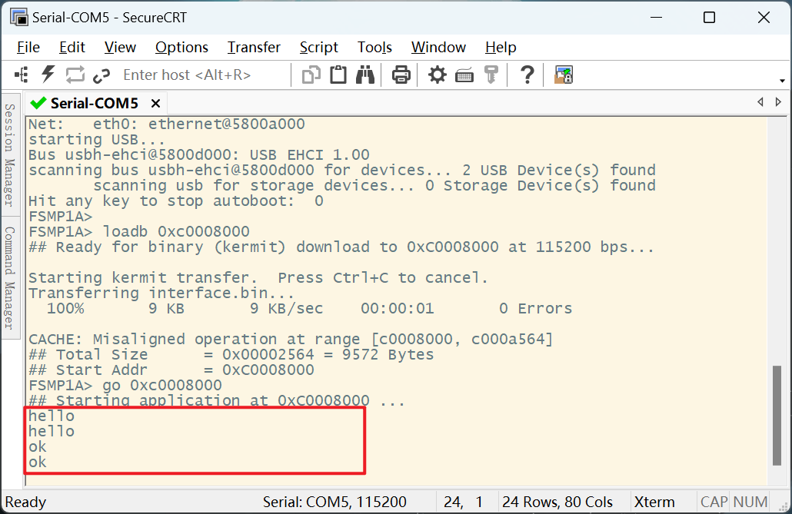

# 作业 实现字符串输入输出

## 效果



## 代码

:::code-group
```c [main.c]
#include "uart4.h"
int main()
{
    uart4_init();

    while (1) {
        put_string(get_string());
    }
    return 0;
}
```

```c [uart.h]
#ifndef __LED_H__
#define __LED_H__

typedef struct {
    unsigned int CR1; // 0X00
    unsigned int CR2; // 0X04
    unsigned int CR3; // 0X08
    unsigned int BRR; // 0x0c
    unsigned int GTPR; // 0x10
    unsigned int RTOR; // 0x14
    unsigned int RQR; //
    unsigned int ISR; // 0x1c
    unsigned int ICR; // 0x
    unsigned int RDR; // 0x
    unsigned int TDR; // 0x
    unsigned int PRESC; // 0x2c
    /*	unsigned int HWCFGR2;   //0x3EC
        unsigned int HWCFGR1;//0X3F0
        unsigned int VERR;//0X3F4
        unsigned int IPIDR;//0X3F8
        unsigned int SIDR;//0X3FC
    */
} USART4_T;

// 结构体地址的初始化
// RCC分频器让AHB4总线和APB1总线使能
#define RCC_MP_AHB4ENSETR (*(volatile unsigned int *)0X50000A28)
#define RCC_MP_APB1ENSETR (*(volatile unsigned int *)0X50000A00) // USART4

// GPIOB和GPIOB的不同寄存器的初始化
#define GPIOB_MODER (*(volatile unsigned int *)0X50003000)
#define GPIOB_AFRL  (*(volatile unsigned int *)0X50003020)
#define GPIOB_AFRH  (*(volatile unsigned int *)0X50003024)
#define GPIOG_MODER (*(volatile unsigned int *)0X50008000)
#define GPIOG_AFRL  (*(volatile unsigned int *)0X50008020)
#define GPIOG_AFRH  (*(volatile unsigned int *)0X50008024)

// 对结构体的初始化
#define USART4 ((USART4_T *)0X40010000)

extern void delay_ms(int ms); // 全局声明
void uart4_init(void);

void put_char(const char str);
void put_string(const char *str);
char get_char(void);
char *get_string(void);

#endif


```


```c [uart.c]
#include "uart4.h"
// 延时函数
void delay_ms(int ms)
{
    int i, j;
    for (i = 0; i < ms; i++)
        for (j = 0; j < 1800; j++)
            ;
}

// 初始化RCC，GPIOB，GPIOG，对应的寄存器
void uart4_init(void)
{
    /* RCC 使能*/
    RCC_MP_AHB4ENSETR |= (0X1 << 6); // G

    RCC_MP_AHB4ENSETR |= (0X1 << 1); // B

    RCC_MP_APB1ENSETR |= (0X1 << 16); // USART4

    /*GPIO初始化*/
    // 1.通过GPIOB_MODER寄存器设置PB2引脚为复用功能模式 MODER[5:4] = 10
    // 2,设置GPIOB_MODER为复用模式下的收发功能
    GPIOB_MODER &= (~(0X3 << 4));

    GPIOB_MODER |= (0X2 << 4);

    GPIOB_AFRL &= (~(0XF << 8));

    GPIOB_AFRL |= (0X1 << 11);

    //**********小心此处的寄存器编号不同*****************
    // 3.通过GPIOG_MODER寄存器设置PG11引脚为复用功能模式  MODER[23:22] = 10
    GPIOG_MODER &= (~(0X3 << 22));

    GPIOG_MODER |= (0X2 << 22);

    GPIOG_AFRH &= (~(0XF << 12));

    GPIOG_AFRH |= (0X6 << 12);

    /*UART初始化*/
    if (USART4->CR1 & (0X1)) {
        delay_ms(500);
        USART4->CR1 &= (~(0X1 << 0));
    }

    USART4->CR1 &= (~(0X1 << 28));

    USART4->CR1 &= (~(0X1 << 12));

    USART4->CR1 &= (~(0X1 << 15));

    USART4->CR1 &= (~(0X1 << 10));

    USART4->CR2 &= (~(0X3 << 12));

    USART4->BRR |= 0X22B;

    USART4->PRESC &= (~(0XF << 0));

    USART4->CR1 |= (0X1 << 3);

    USART4->CR1 |= (0X1 << 2);

    USART4->CR1 |= (0X1 << 0);
}

// 发送一个字符
void put_char(const char str)
{
    // 发送数据寄存器为空  0满1空
    while (!(USART4->ISR & (0X1 << 7)))
        ;

    USART4->TDR = str;

    // 判断发送一帧数据是否完成   0未完成1完成
    while (!(USART4->ISR & (0X1 << 6)))
        ;
}

// 发送一个字符串
// 1.判断发送寄存器是否为空，空(1)可以发送下一个字节,否则需要等待寄存器为空
void put_string(const char *str)
{
    while (*str) {
        put_char(*str++);
    }

    put_char('\n');
    put_char('\r'); // 	'\r'是回车
}

// 接收一个字符
char get_char(void)
{
    char ch;
    // 1.判断接收数据寄存器是否有有效数据，读1表示有有效数据，否则没有有效数据
    // ISR[5]
    while (!(USART4->ISR & (0X1 << 5)))
        ; // 有0为0
    ch = USART4->RDR;

    return ch;
}

// 接收一个字符串
char buf[50] = { 0 };

char *get_string(void)
{
    unsigned int i;

    for (i = 0; i < 49; i++) {
        buf[i] = get_char();

        put_char(buf[i]);

        if (buf[i] == '\r')
            break;
    }

    buf[i] = '\0';
    put_char('\n');

    return buf;
}


```
:::