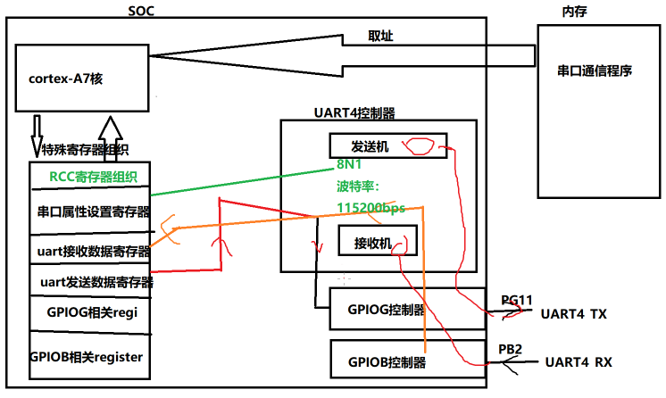
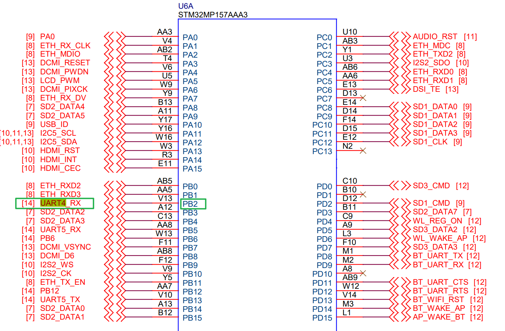
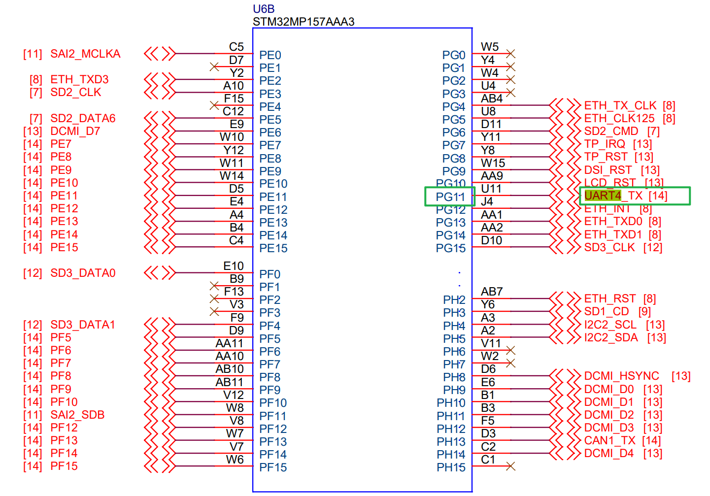
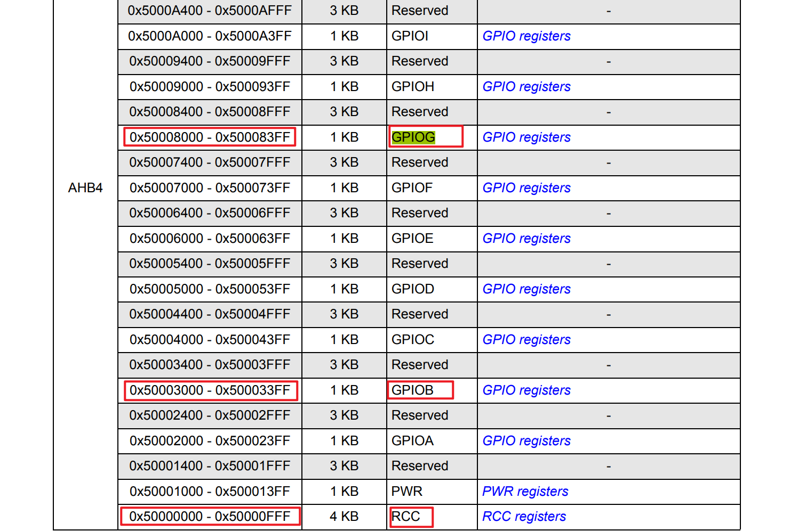
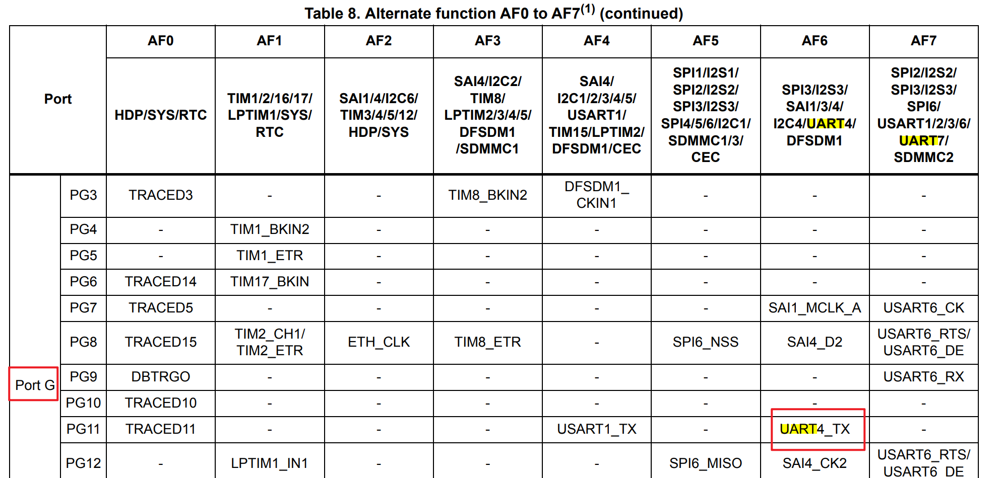
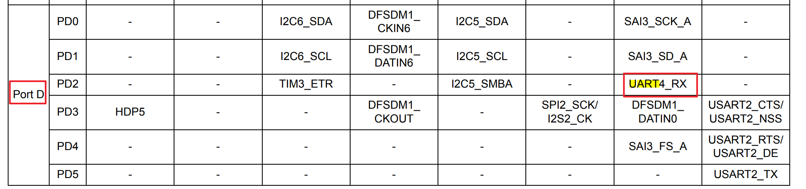
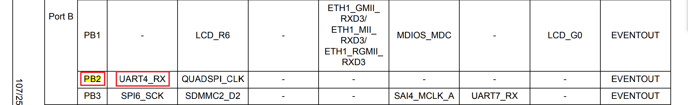
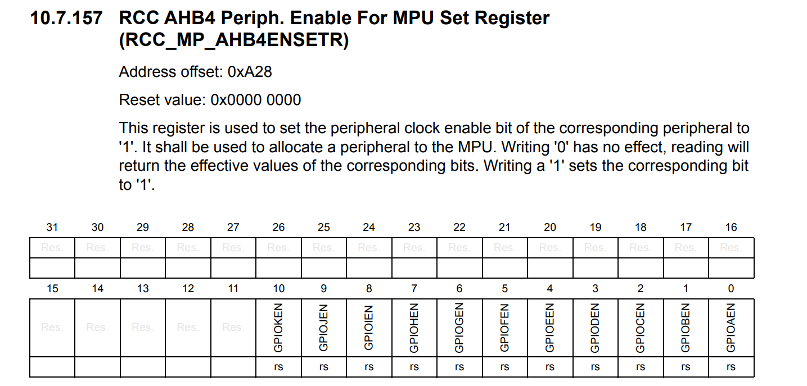
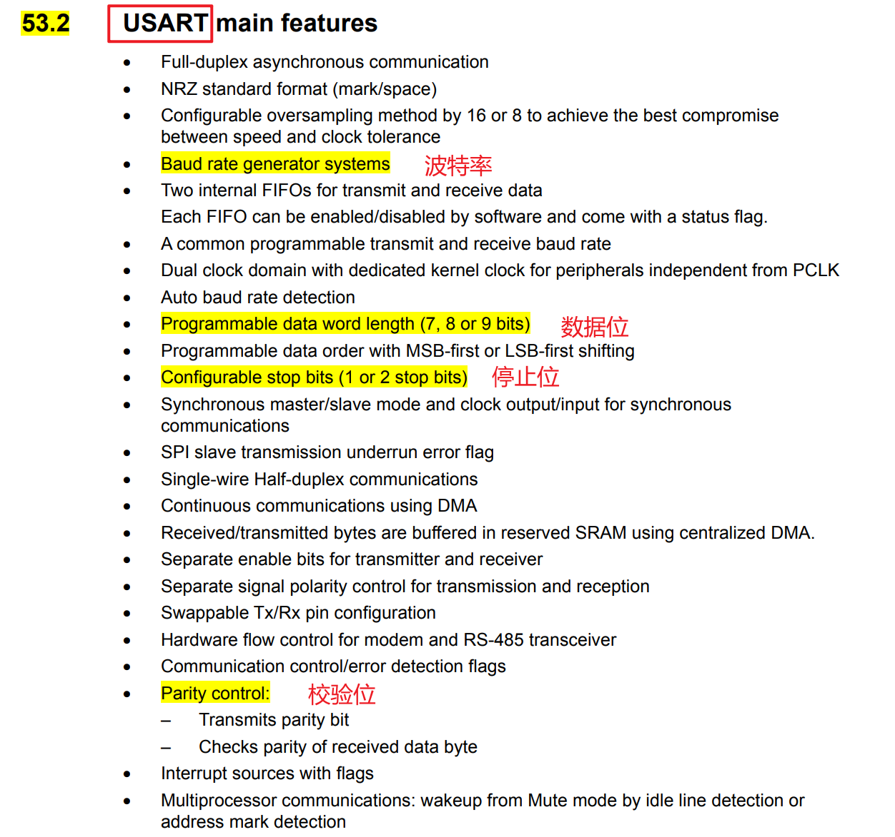

# 使用STM32MP156进行串口通信

> 思路
> 1. PG11或PB2 设置位 UART4 功能（[UART](UART.md) 也是一个外设 需要占用一个 GPIO）
> 2. 设置 [串口帧格式](UART工作原理.md)
> 3. 设置波特率
> 4. GPIO控制器时钟使能
> 5. UART的时钟使能

## PG11或PB2 设置位 UART4 功能

查看 `FS_MP1A` 原理图
- UART4_RX ==> PB2
- UART4_TX ==> PG11

在 `STM32MP157-datasheet` 中找到对应的基地址

`stm32mp157a` 手册 p102

## 设置串口帧格式

## 时钟使能

`STM32MP157-datasheet.pdf`

根据[UART帧格式](UART工作原理.md)配置
