# 使用STM32MP157A的M4内核点亮LED1

>简要步骤
>1. 更改STM32MP157的启动方式
>2. 使用STM32CubeMX创建工程
>		- 配置要使用的GPIO，并分配给M4内核
>		- 项目相关的配置
>3. 在MDK中调试
>		-  配置仿真

## 更改STM32MP157的启动方式

## 使用STM32CubeMX创建工程

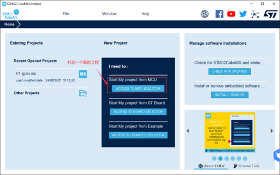

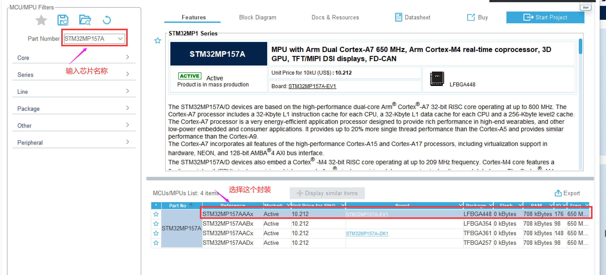

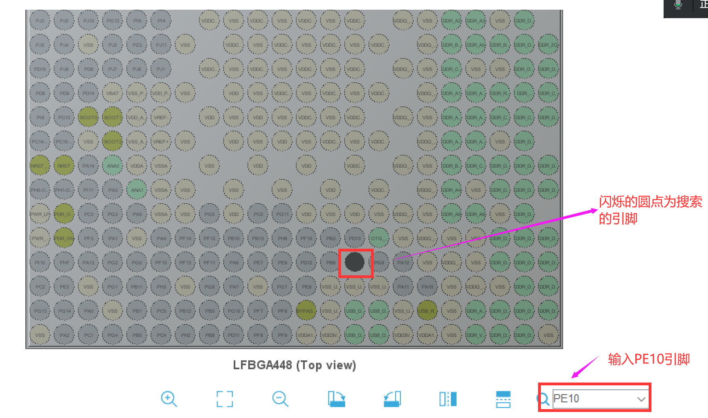

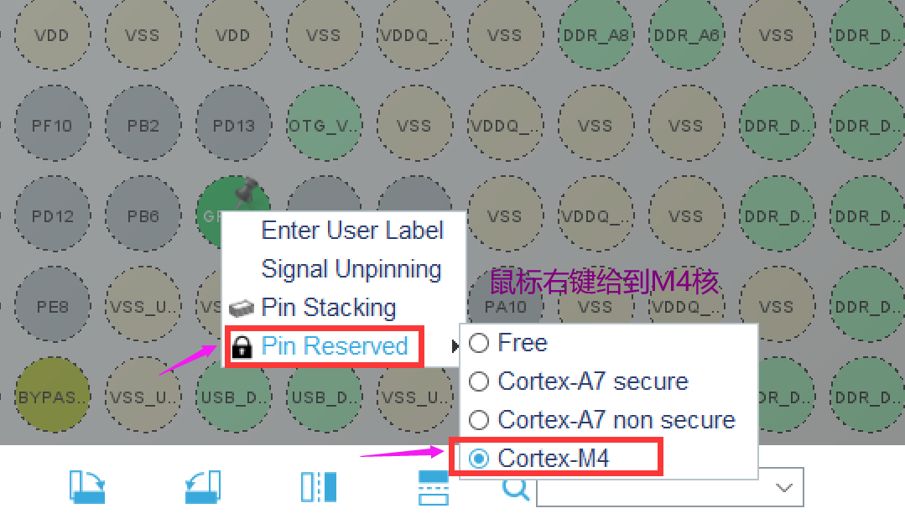

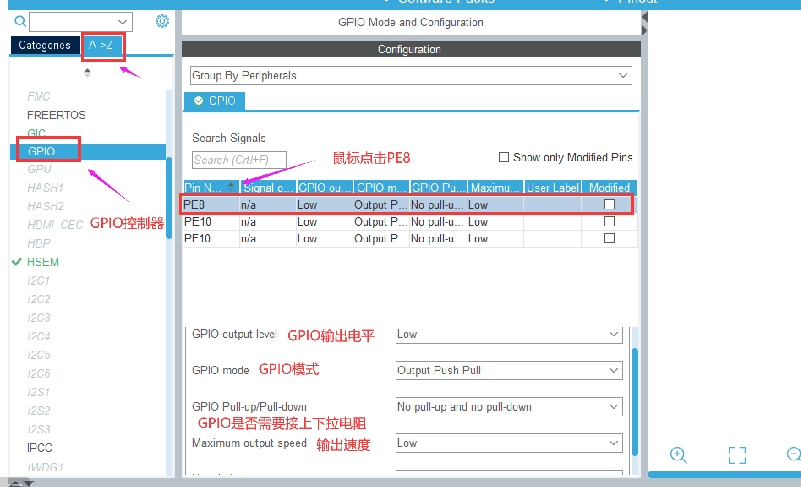

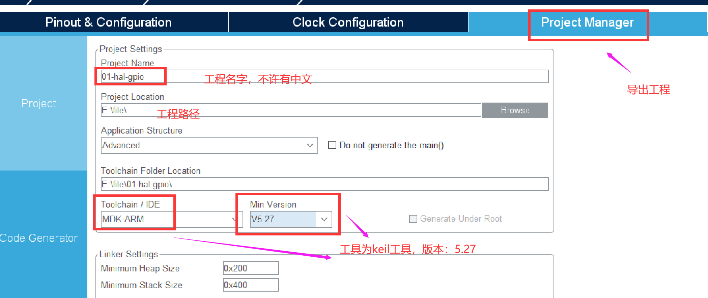

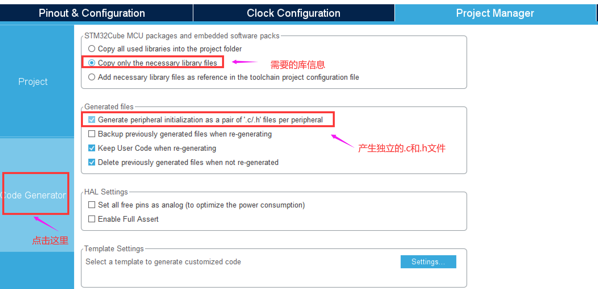

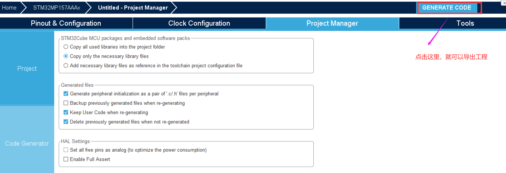

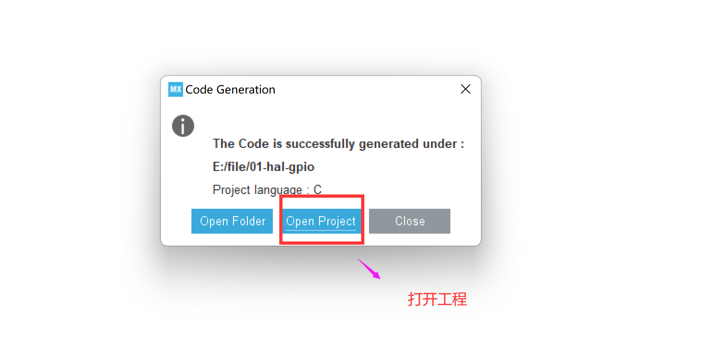

## 在MDK中调试

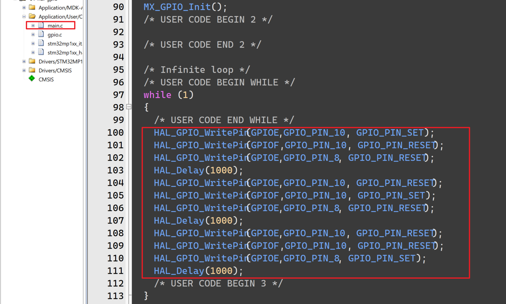

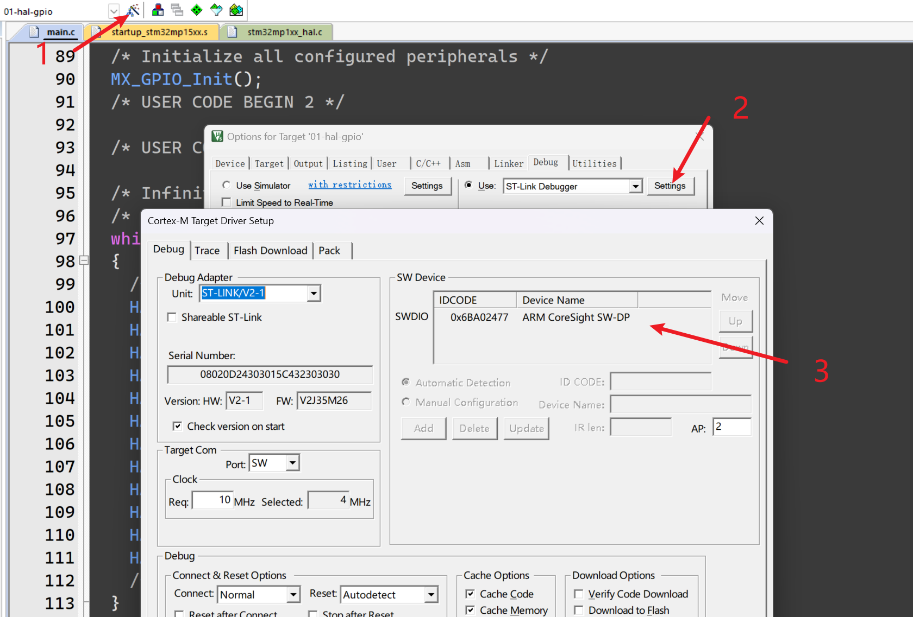

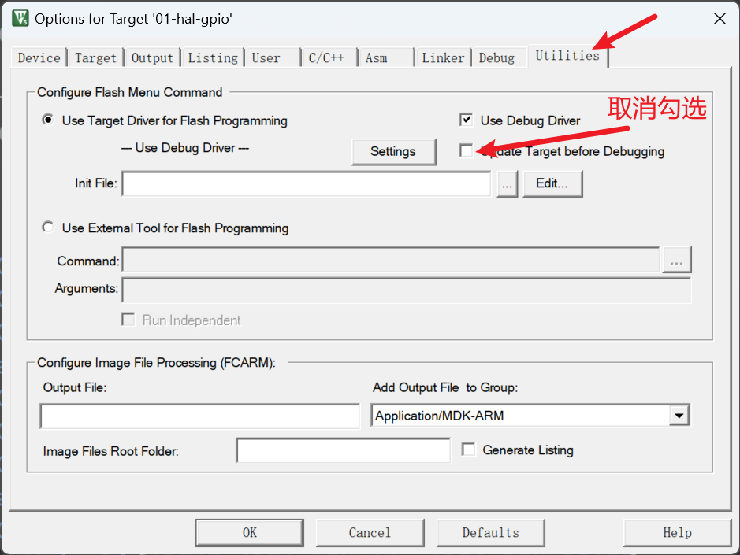

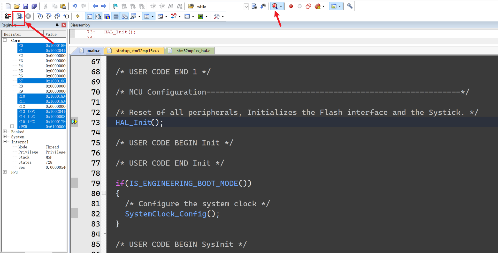