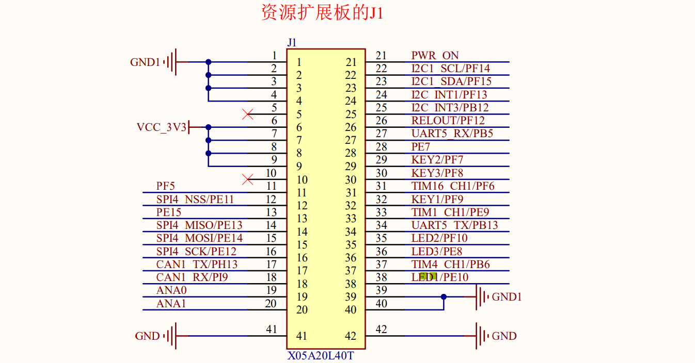

# 依据网络标号，在开发板的资源扩展板上查询 LED1 的 GPIO

```url
D:\user\documents\学习资料\arm\STM32MP157\01_参考资料\01.2_原理图\扩展板\FS_MP157_PHD_TO_FFC.pdf
```



查得 对应的GPIO位 `PE10`

- P：GPIO
- E：STM32MP157将GPIO分组，通过ABCDE命名
- 10：每组GPIO都有16个管脚，10即第十个