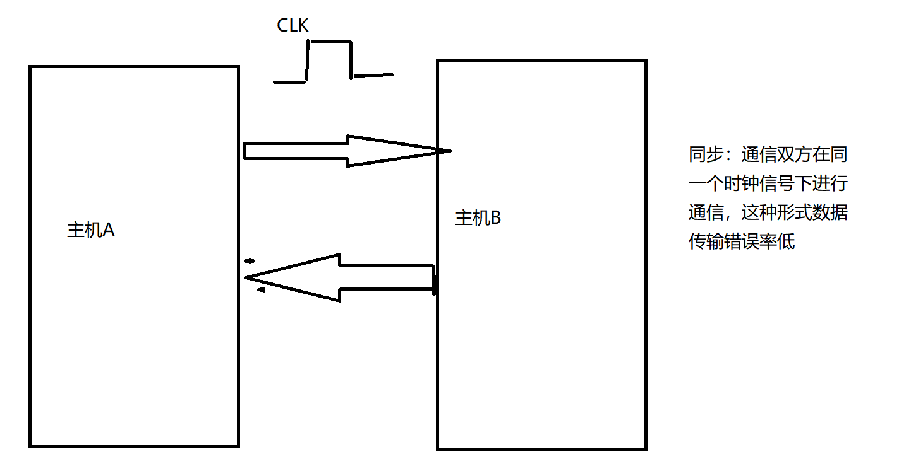

# 同步总线

## 定义

数据传输时采用同步时钟信号进行同步，发送方和接收方都使用同一个时钟信号来控制数据的传输

## 作用

- 实现高速的数据传输

## 特点

- 实现高速数据传输
- 可靠的同步
	- 发送方和接收方都使用同一个时钟信号进行同步，可以保证数据传输的准确性和可靠性
- 实现比较简单，成本较低

## 应用

- 用于一些低速、简单的通信场合
	- SPI
	- I2C
		- 传感器、存储器、显示器
	- PCI总线
	- DDR内存总线