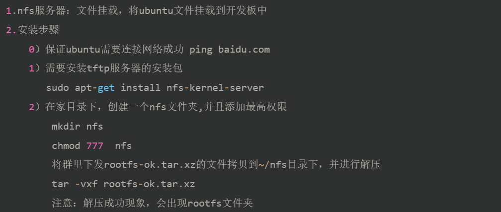
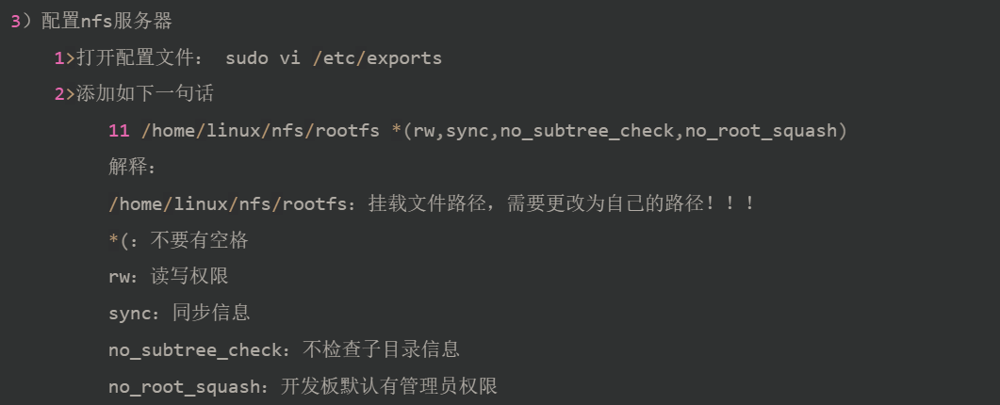
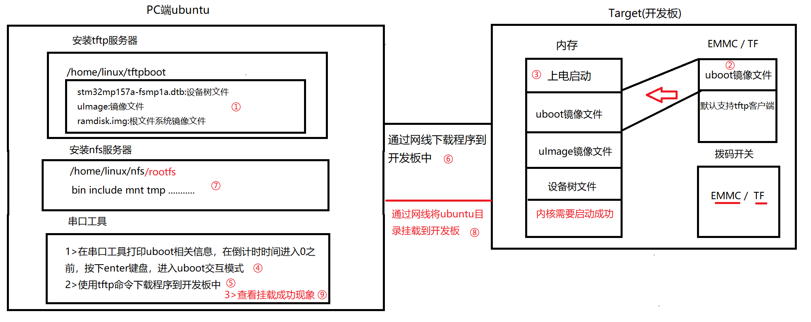

# 搭建 NFS 服务器

## 安装 NFS 服务器

### 安装



### 配置



### 操作


挂载的 mnt
```
sudo mount -t nfs 192.168.0.180:/home/shelton/Workspaces/nfs/rootfs /mnt
```

>必须在ubuntu中操作，不能用sshl的去连接

取消挂载

```
sudo umount /mnt
```

> 有进程使用nfs服务器时，无法取消挂载

## 作用



1、在~/tftpboot目录下，准备需要下载开发板中的文件
2、在EMMC中/TF卡中烧写uboot镜像文件
3、开饭需要上电，uboot镜像文件被加载到内存中运行
4、uboot进行启动，启动成功之后，会在串口工具打印uboot信息
5、使用tftp命令下载程序到开发板内存中，内核进行启动
6、内核启动成功之后，挂载根文件系统