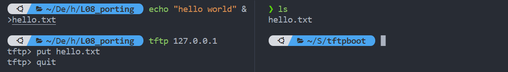

# 搭建 TFTP 服务器

## 安装

> TFTP：基于UDP协议，用于传输文本文件（基于网络上传下载）

- TFTP 服务器
	- tftpd-hpa
		- 功能简单，配置简单
	- tftp-hpa（**这个也可以安装**）
		- 支持更多功能，配置更灵活

```bash
sudo apt-get install tftpd-hpa
```

## 配置

编辑配置文件 `tftpd-hpa`

```shell
sudo vim /etc/default/tftpd-hpa
```

```shell
# /etc/default/tftpd-hpa

#指定 TFTP 服务器使用的用户
TFTP_USERNAME="tftp"

#指定 TFTP 服务器的根目录
TFTP_DIRECTORY="/home/shelton/Workspaces/tftpboot"

# 指定 TFTP 服务器监听的地址和端口号
TFTP_ADDRESS="0.0.0.0:69"

# 指定 TFTP 服务器的一些选项
	# "-c" 表示允许客户端上传文件
	# "-l" 表示记录日志，
	# "-s" 表示将 TFTP_DIRECTORY 设为根目录。
TFTP_OPTIONS="-c -l -s" 
```

重启服务器，让配置生效
```shell
sudo service tftpd-hpa restart
```

## 测试

上传

下载
