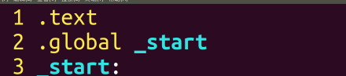
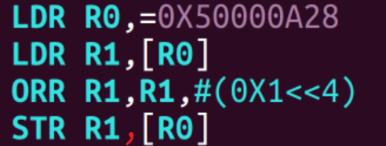
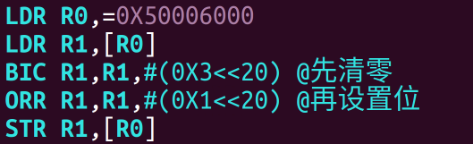
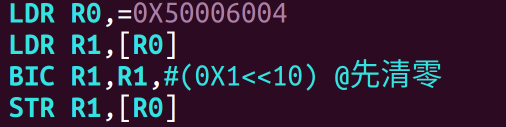
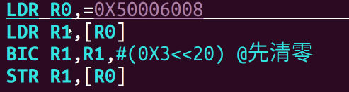
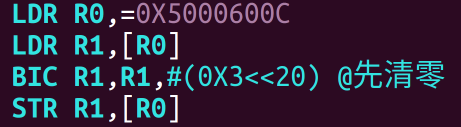
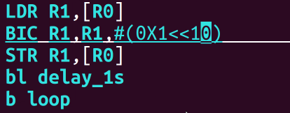
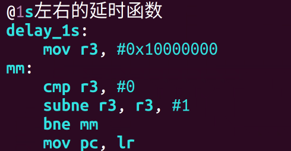

# 编写汇编程序控制 GPIO 控制器 和 RCC 进行工作



[设置RCC使能](设置RCC使能.md) （起始地址为什么是0x5000A28 #待收录 ）



设置PE10管教为输出模式



设置推挽输出



设置PE10输出速度为低速



不设置上拉下拉电阻



循环输出高低电平 #待收录 

亮一秒 #待收录 

灭一秒


延时函数    （作用？ #待收录 ）



完整代码

```arm-asm
.text 
.global _start
_start: 
@设置RCC寄存器使能
LDR R0,=0X50000A28 
LDR R1,[R0] 
ORR R1,R1,#(0X1<<4) 
STR R1,[R0] 
 
@设置PE10管脚为输出模式
LDR R0,=0X50006000 
LDR R1,[R0] 
BIC R1,R1,#(0X3<<20) @先清零 
ORR R1,R1,#(0X1<<20) @再设置位 
STR R1,[R0] 
 
@设置PE0为推挽输出
LDR R0,=0X50006004 
LDR R1,[R0] 
BIC R1,R1,#(0X1<<10) @先清零 
STR R1,[R0] 
 
@设置PE10速度为低速
LDR R0,=0X50006008 
LDR R1,[R0] 
BIC R1,R1,#(0X3<<20) @先清零 
STR R1,[R0] 
@不设置上拉下拉电阻
LDR R0,=0X5000600C 
LDR R1,[R0] 
BIC R1,R1,#(0X3<<20) @先清零 
STR R1,[R0] 
 
@循环输出高低电平
LDR R0,=0X50006014 
loop: 
 @亮一秒
LDR R1,[R0] 
ORR R1,R1,#(0X1<<10) 
STR R1,[R0] 
bl delay_1s
@灭一秒
LDR R1,[R0] 
BIC R1,R1,#(0X1<<10) 
STR R1,[R0] 
bl delay_1s
b loop

 
@1s左右的延时函数
delay_1s: 
	mov r3, #0x10000000 
mm: 
 cmp r3, #0 
	subne r3, r3, #1 
	bne mm
	mov pc, lr
.end

```