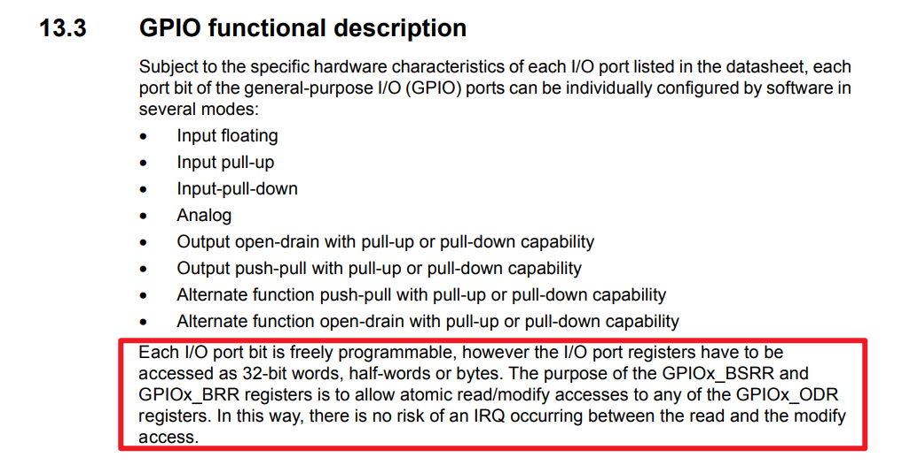

# 芯片手册分析

`D:\user\documents\学习资料\arm\STM32MP157\01_参考资料\01.1_数据手册\STM32MP157-datasheet.pdf`
P1065
13 General-purpose I/Os (GPIO)

GPIO控制器工作

[Bit set or reset registers方式和from on-chip peripheral的区别](Bit%20set%20or%20reset%20registers方式和from%20on-chip%20peripheral的区别.md)

[mos管](mos管.md)

通过特殊功能寄存器配置
- [GPIO输出模式](GPIO输出模式.md)
	- [推挽输出](推挽输出.md)
	- [开漏输出](开漏输出.md)

什么叫使能 #待收录 