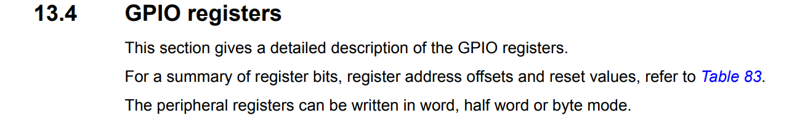

# 通过特殊功能寄存器配置GPIO

```
D:\user\documents\学习资料\arm\STM32MP157\01_参考资料\01.1_数据手册\STM32MP157-datasheet.pdf
```
p1076



- 寄存器基地址查找

- [GPIO端口模式寄存器](GPIO端口模式寄存器.md)
- [GPIO端口输出类型寄存器](GPIO端口输出类型寄存器.md)
- [输出速度设置寄存器](输出速度设置寄存器.md)
- [GPIO上拉-下拉电阻设置设置寄存器](GPIO上拉-下拉电阻设置设置寄存器.md)
- [GPIO输入数据寄存器](GPIO输入数据寄存器.md)
- [GPIO输出数据寄存器](GPIO输出数据寄存器.md)
- GPIO port bit set/reset register (GPIOx_BSRR) (x = A to K, Z
- GPIO port configuration lock register (GPIOx_LCKR) (x = A to K, Z
- GPIO alternate function low register (GPIOx_AFRL) (x = A to K, Z)
- GPIO alternate function high register (GPIOx_AFRH) (x = A to K, Z)